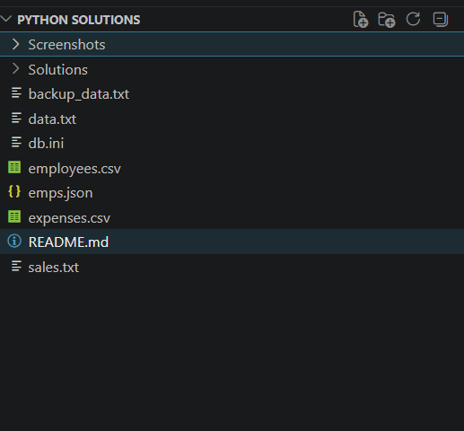
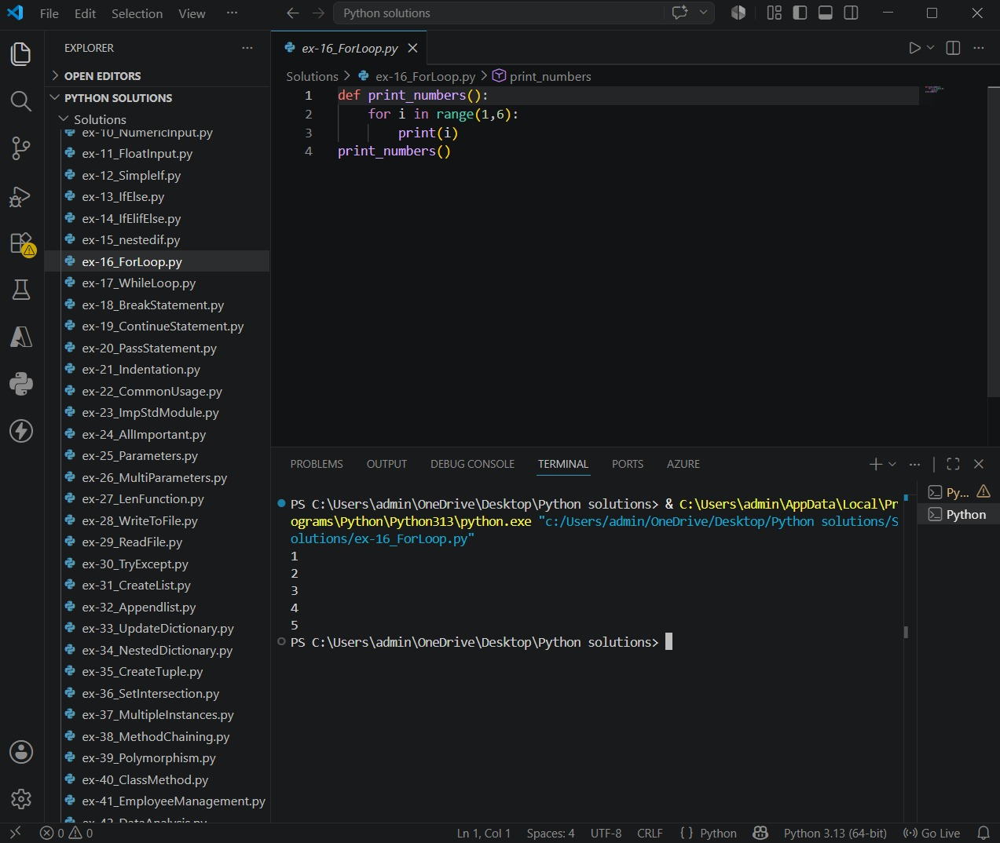
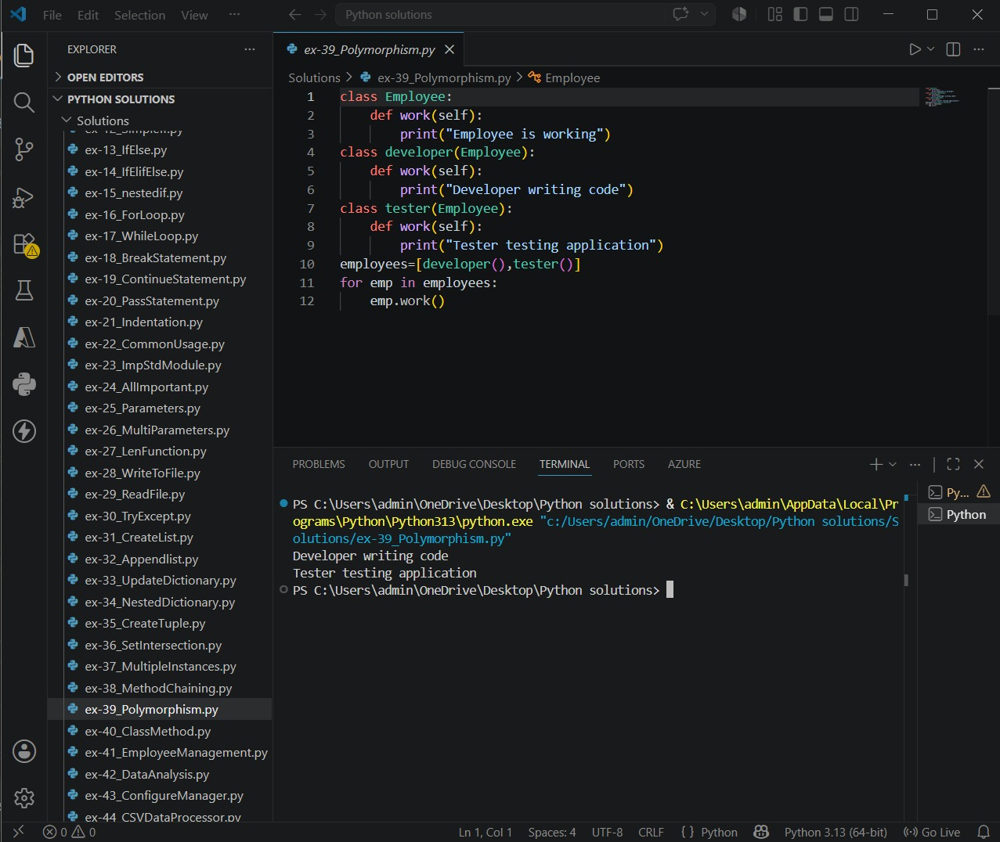
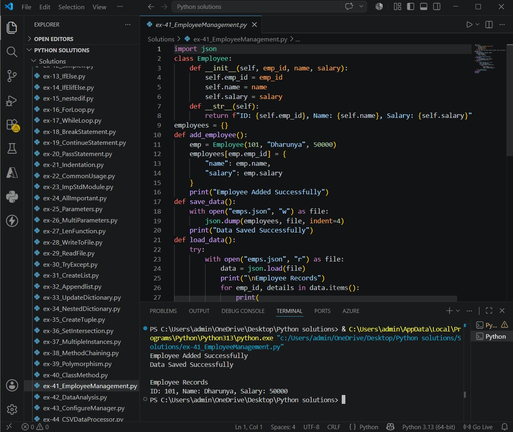
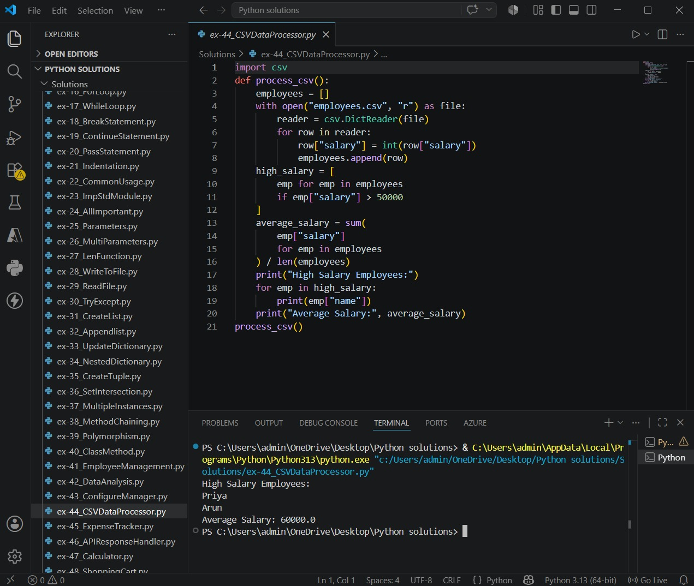
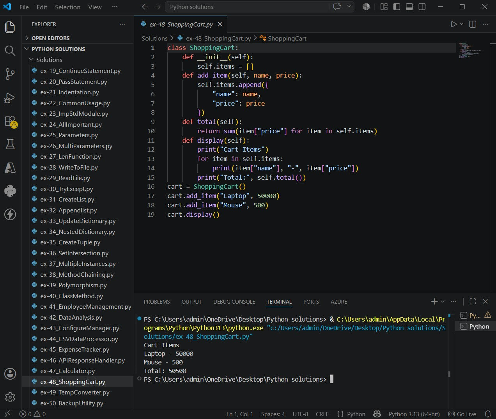
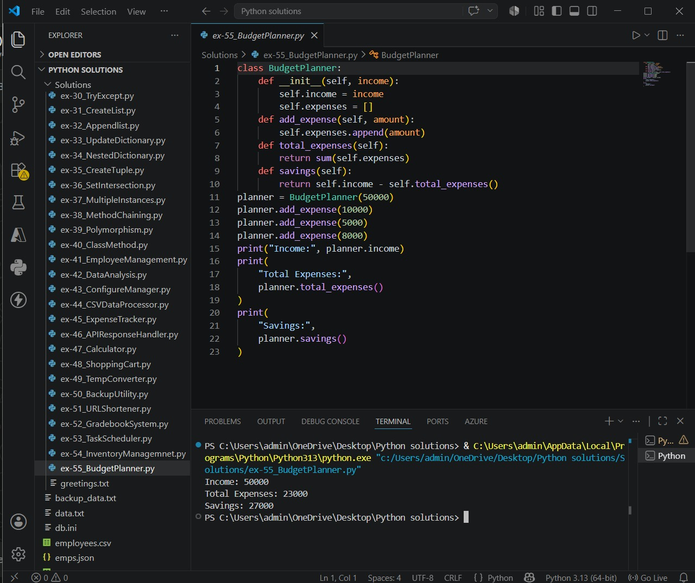

# Python Upskilling Solutions

This repository contains solutions for all 55 Python Upskilling exercises completed as part of the Digital Nurture 5.0 learning program.

## Topics Covered

### Python Basics
- Variables
- Data Types
- Input and Output
- Operators

### Control Flow
- If Statements
- If-Else
- Loops
- Break and Continue

### Functions and Modules
- User Defined Functions
- Parameters
- Built-in Functions
- Importing Modules

### File Handling
- Read Files
- Write Files
- Exception Handling

### Collections
- Lists
- Dictionaries
- Tuples
- Sets

### Object-Oriented Programming
- Classes and Objects
- Multiple Instances
- Polymorphism
- Class Methods

### Mini Projects
- Employee Management System
- Data Analysis Pipeline
- Configuration Manager
- CSV Data Processor
- Expense Tracker
- API Response Handler
- Calculator
- Shopping Cart System
- Temperature Converter
- Backup Utility
- URL Shortener
- Gradebook System
- Task Scheduler
- Inventory Manager
- Budget Planner

## Repository Structure

```text
Python Solutions/
├── ex-1_HelloWorld.py
├── ex-2_JupyterNotebook.py
...
├── ex-55_BudgetPlanner.py
```
## Screenshots
Below are a few sample screenshots from the Python Upskilling exercises and mini-projects included in this repository.

### Repository Structure


### For Loop


### Polymorphism


### Employee Management System


### CSV Data Processor


### Shopping Cart System


### Budget Planner



Note: Only a subset of screenshots is shown here. The repository contains complete solutions for all 55 exercises.

## Tools Used

- Python 3.9.0
- Visual Studio Code
- Git
- GitHub

## Author
Dharunyadevi S
B.Tech-IT
Saveetha Engineering College